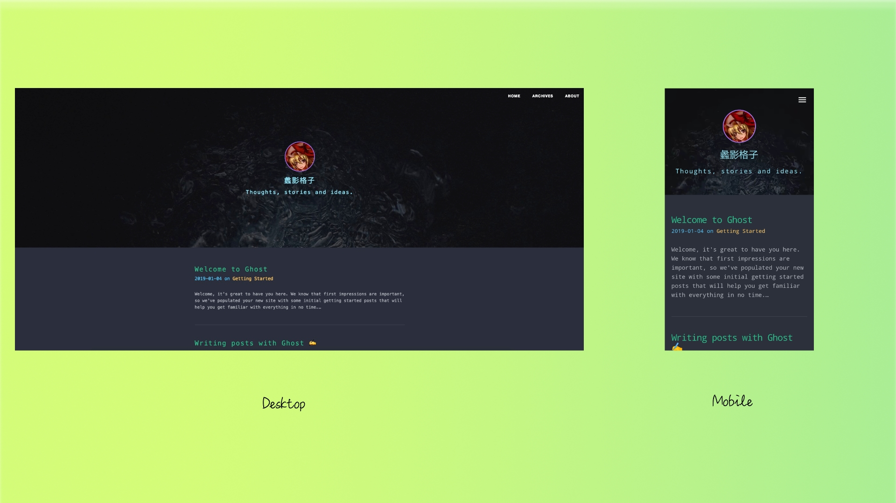

<p align="center"></p>

# the-shell-pro

一款简约的ghost主题，大胆的用色，献给同样追求小众、喜欢极客暗夜风格的你❤️

# 预览

<p align="center"></p>

体验请点击[Demo](http://blog.neulana.com:2368/)

# 特性

- [x] 简约 暗黑风格
- [x] 多端适配，多浏览器兼容
- [x] 全局导航栏
- [x] 归档页
- [x] 代码高亮
- [x] 一键复制代码块
- [x] 返回顶部
- [x] 社交网站支持
- [x] 支持Disqus评论
- [x] 颜色方案参考[dracula](https://draculatheme.com/)
- [ ] 中英双语切换
- [ ] TOC目录
- [ ] 支持Valine评论（针对墙内访客）

# 使用

## 基础

克隆代码到**themes**目录下：

```bash
git clone https://github.com/Neulana/the-shell-pro.git
```

然后进入：

ghost后台 > `Design` > `Active the-shell-pro theme`

## 添加归档页

在归档页面列出所有已发布的文章。操作步骤：

- 进入ghost后台;

- New Post > 标题输入`Archives`，这时文章的地址默认为`archives`;
- Post Settings > 勾选`Turn this post into a page`，然后Publish;
- Navigation > 创建一个`归档`导航，地址为：`http://your_blog_url/archives`

## 开启Disqus

支持Disqus讨论插件，只需在后台`Code Injection`处添加一段代码：

> 位置：ghost后台 > `Code Injection` > `Blog Header`

```javascript
<script>
    var disqus_shortname = 'your_disqus_shortname';
</script>
```

## 开启社交

在每篇文章底部展示自己的各大社交网站个人主页链接，目前仅支持国内常用的几家：豆瓣、知乎、微博、Github，未来考虑增加国外的社交网站。

> 位置：ghost后台 > `Code Injection` > `Blog Header`

```javascript
<script>
    var social_accounts = [
        {'site_name': 'douban', 'user_url': 'https://www.douban.com/people/94946501'},
        {'site_name': 'zhihu', 'user_url': 'https://www.zhihu.com/people/pinyoufu'},
        {'site_name': 'weibo', 'user_url': 'https://weibo.com/5610949777'},
        {'site_name': 'github', 'user_url': 'https://github.com/Neulana'},
    ]
</script>
```

请`仅仅`将上方的user_url后缀的个人id替换成你自己的id，**请勿修改变量名称**。

## 代码高亮

`the-shell-pro`使用[highlight.js](https://github.com/isagalaev/highlight.js)实现代码高亮，默认使用的主题风格为 `monokai-sublime`，你也可以替换为你喜欢的代码高亮样式，可用[CDN](https://cdnjs.com/libraries/highlight.js)资源：

> 位置：ghost后台 > `Code Injection` > `Blog Header`

```html
<!-- use solarized-dark style -->
<link rel="stylesheet" type="text/css" href="https://cdnjs.cloudflare.com/ajax/libs/highlight.js/9.13.1/styles/solarized-dark.min.css" />
```

# Credit

This theme is inspired by [The-Shell](https://github.com/mityalebedev/The-Shell)

<div>Logo icon made by <a href="https://www.freepik.com/" title="Freepik">Freepik</a> from <a href="https://www.flaticon.com/" 			    title="Flaticon">www.flaticon.com</a> is licensed by <a href="http://creativecommons.org/licenses/by/3.0/" 			    title="Creative Commons BY 3.0" target="_blank">CC 3.0 BY</a></div>

